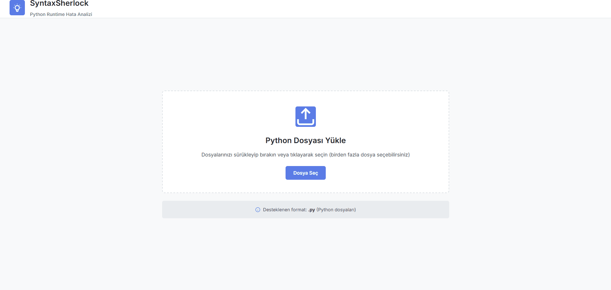
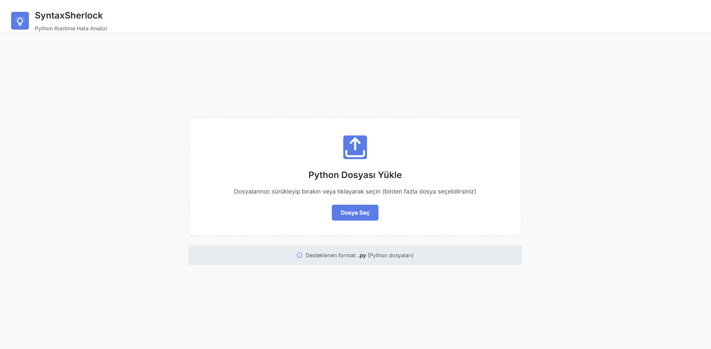
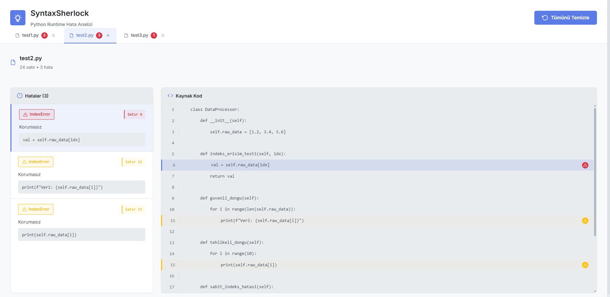
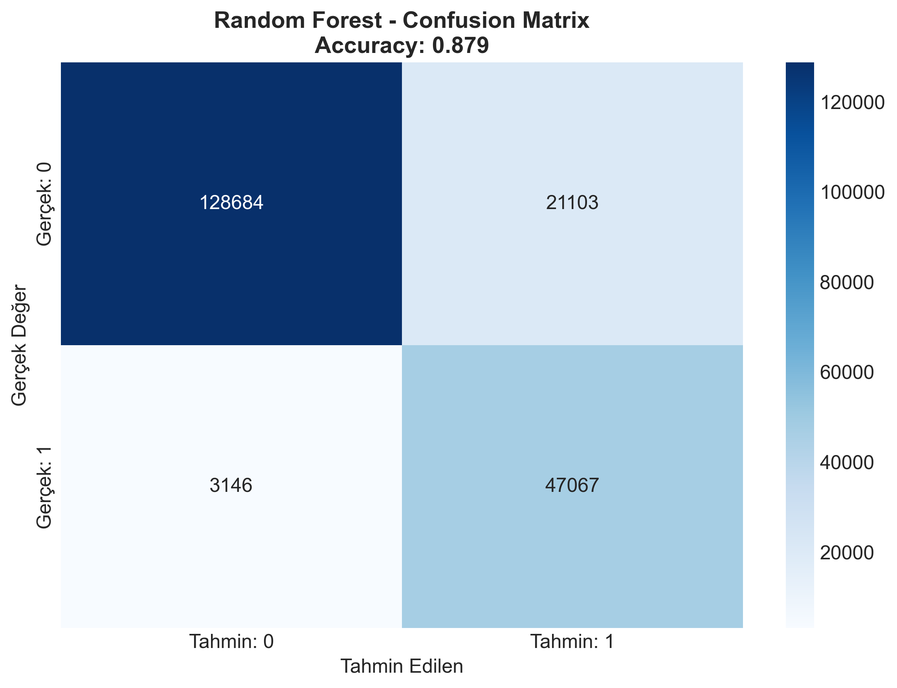
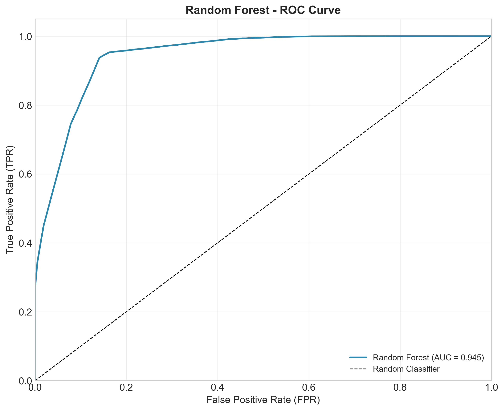
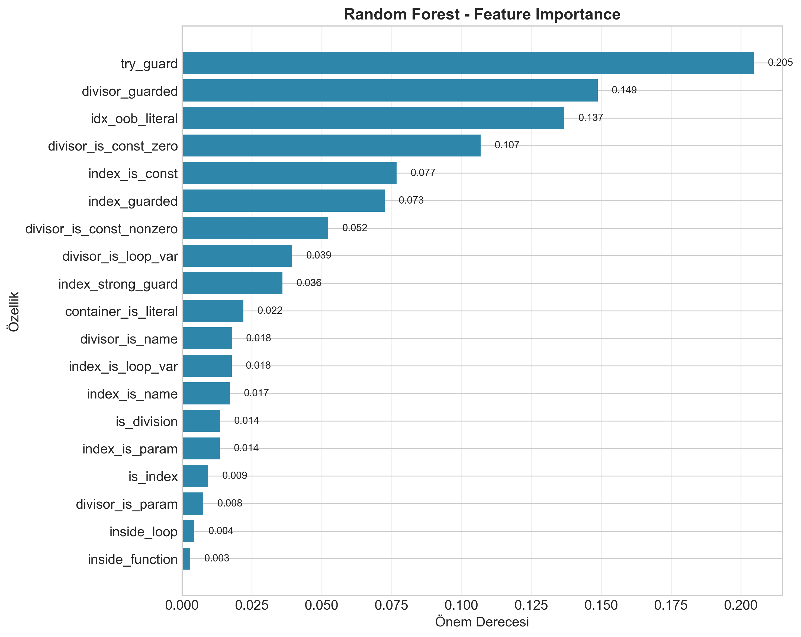

# 🔍 SyntaxSherlock - Runtime Error

**Machine Learning-based Runtime Error Prediction System for Python Code**

SyntaxSherlock is a web application that detects potential runtime errors (ZeroDivisionError, IndexError) in Python code using machine learning.


## 🎬 Demo



## 📸 Screenshots

<table>
  <tr>
    <td align="center">
      
      <br />
      <b>File Upload</b>
    </td>
    <td align="center">
      
      <br />
      <b>Analysis Results</b>
    </td>
  </tr>
</table>

## 📋 Table of Contents

- [Features](#-features)
- [Architecture](#-architecture)
- [Installation](#-installation)
- [Usage](#-usage)
- [API Reference](#-api-reference)
- [Model Training](#-model-training)
- [Project Structure](#-project-structure)

## ✨ Features

- 🎯 **Smart Error Detection**: Predicts potential runtime errors in Python code
- 📊 **Risk Scoring**: Calculates risk score between 0-1 for each line
- 🔒 **Definite Error Detection**: Identifies definite errors through static analysis
- 🖥️ **Modern Web Interface**: User-friendly interface built with React + TypeScript
- 🚀 **Fast API**: High-performance REST API with FastAPI
- 📈 **Random Forest Model**: 90%+ accuracy rate

## 🏗️ Architecture

```
┌─────────────────┐     HTTP/REST      ┌─────────────────┐
│   React + TS    │ ◄────────────────► │    FastAPI      │
│   (Frontend)    │                    │    (Backend)    │
└─────────────────┘                    └────────┬────────┘
                                                │
                                       ┌────────▼────────┐
                                       │  Random Forest  │
                                       │     Model       │
                                       └─────────────────┘
```


## 🚀 Installation

### Requirements

- Python 3.11+
- Node.js 18+
- npm or yarn

### Backend Setup

```bash
# Navigate to backend directory
cd backend

# Create virtual environment
python -m venv venv

# Activate virtual environment
# Windows:
.\venv\Scripts\activate
# Linux/Mac:
source venv/bin/activate

# Install dependencies
pip install -r requirements.txt

# Train the model (required for first setup)
python train.py
```

### Frontend Setup

```bash
# Navigate to frontend directory
cd frontend

# Install dependencies
npm install
```

## 🎮 Usage

### Start Backend

```bash
cd backend
.\venv\Scripts\activate  # or: source venv/bin/activate
python api.py
```

Backend will run at `http://localhost:8000`

### Start Frontend

```bash
cd frontend
npm run dev
```

Frontend will run at `http://localhost:5173`

### How to Use

1. Open the web interface (`http://localhost:5173`)
2. Drag and drop your Python files or click to select
3. Click "Analyze" button
4. Review risk scores and potential errors

## 📡 API Reference

### GET /
API health check

**Response:**
```json
{
  "message": "SyntaxSherlock API is running! Use POST /analyze to scan files."
}
```

### POST /analyze
Analyze Python files

**Request:** File upload with `multipart/form-data`

**Response:**
```json
{
  "results": [
    {
      "filename": "example.py",
      "status": "success",
      "risks": [
        {
          "lineno": 5,
          "code": "result = x / y",
          "type": "Division",
          "risk_score": 0.85,
          "message": "Unguarded",
          "definite_error": false
        }
      ]
    }
  ]
}
```

## 🤖 Model Training

The model predicts runtime error probability using Python code features.

### Features Used

| Feature | Description |
|---------|-------------|
| `is_division` | Is it a division operation? |
| `is_index` | Is it an index access? |
| `inside_loop` | Is it inside a loop? |
| `inside_function` | Is it inside a function? |
| `try_guard` | Is it inside a try-except block? |
| `divisor_guarded` | Is the divisor checked? |
| `index_guarded` | Is the index checked? |
| ... | and more |

### Retrain the Model

```bash
cd backend
python train.py
```

This command will:
- Train the model
- Save performance charts to `model_results/` folder
- Save model file as `syntax_sherlock_model.pkl`

## 📁 Project Structure

```
SyntaxSherlock/
├── backend/
│   ├── api.py              # FastAPI application entry point
│   ├── scanner.py          # Code analysis and feature extraction
│   ├── train.py            # Model training script
│   ├── requirements.txt    # Python dependencies
│   ├── dataset_thinking.csv # Training dataset
│   └── model_results/      # Training charts
│
├── frontend/
│   ├── src/
│   │   ├── App.tsx         # Main application component
│   │   ├── components/     # React components
│   │   ├── services/       # API services
│   │   └── types.ts        # TypeScript types
│   ├── package.json
│   └── vite.config.ts
│
├── standalone/
│   ├── app.py              # Standalone application
│   ├── build.py            # Build script for exe
│   └── README.md           # Build instructions
│
├── screenshots/            # UI screenshots
├── test/                   # Test files
├── .gitignore
├── LICENSE
└── README.md
```

## 📊 Model Performance

Example metrics after model training:

| Metric | Value |
|--------|-------|
| Accuracy | ~0.92 |
| Precision | ~0.89 |
| Recall | ~0.91 |
| F1-Score | ~0.90 |
| ROC-AUC | ~0.95 |

### Training Visualizations

<table>
  <tr>
    <td align="center">
      
      <br />
      <b>Confusion Matrix</b>
    </td>
    <td align="center">
      
      <br />
      <b>ROC Curve</b>
    </td>
  </tr>
  <tr>
    <td align="center">
      
      <br />
      <b>Feature Importance</b>
    </td>
    <td align="center">
      
      <br />
      <b>Performance Metrics</b>
    </td>
  </tr>
</table>

## 📥 Download

Get the latest release from [GitHub Releases](../../releases/latest):

| File | Description |
|------|-------------|
| `SyntaxSherlock-vX.X.X-windows.zip` | Complete package (recommended) |
| `SyntaxSherlock.exe` | Executable only |

### Quick Start
1. Download the `.zip` file from Releases
2. Extract to a folder
3. Run `SyntaxSherlock.exe`
4. Browser opens automatically at http://localhost:8000

## 📦 Build from Source

You can also build the executable yourself:

```bash
cd standalone
python build.py
```

This will create `standalone/dist/SyntaxSherlock.exe`. 

**Important:** Copy `syntax_sherlock_model.pkl` to the same folder as the exe!

See [standalone/README.md](standalone/README.md) for details.

## 🤝 Contributing

1. Fork this repository
2. Create a feature branch (`git checkout -b feature/amazing-feature`)
3. Commit your changes (`git commit -m 'Add amazing feature'`)
4. Push to the branch (`git push origin feature/amazing-feature`)
5. Open a Pull Request

## 📄 License

This project is licensed under the MIT License. See the [LICENSE](LICENSE) file for details.

## 👥 Authors

- **Gökhan Güçlü** - *Developer* - [GitHub](https://github.com/gokhanguclu)
- **Metin Karyağdı** - *Developer* - [GitHub](https://github.com/metinkaryagdi)

---

<p align="center">
  <strong>🔍 SyntaxSherlock</strong> - Discover bugs in your Python code!
</p>
